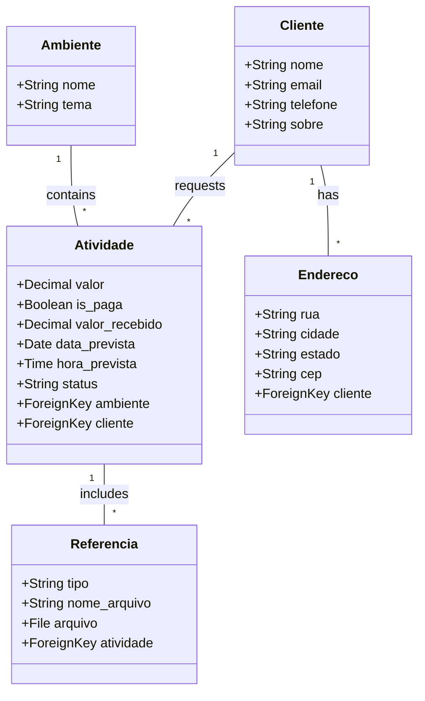

# System Patterns

## System Architecture
The project follows a standard **Django Monolithic Architecture**.
- **Frontend**: Server-side rendered Django Templates (HTML/CSS).
- **Backend**: Django (Python) handling business logic, routing, and ORM.
- **Database**: PostgreSQL.
- **Containerization**: Docker and Docker Compose for service orchestration.

## Key Technical Decisions
- **Separation of Concerns**: Functionality is split into two main apps:
    - `ambiente`: Handles environment/context definitions.
    - `atividade`: Handles the core business logic of activities, clients, and references.
- **Database Design**:
    - Normalized relational database schema.
    - Foreign Keys used to link `Atividade` to `Ambiente` and `Cliente`.
    - Cascading deletes configured appropriately (e.g., deleting an `Ambiente` deletes its `Atividade`s).

## Component Relationships

## Design Patterns
- **MVT (Model-View-Template)**: Standard Django pattern.
- **Fat Models (Partial)**: Models contain string representations and business data definitions.
- **Service Layer**: (To be determined/verified) Business logic likely resides in Views or Models currently.

